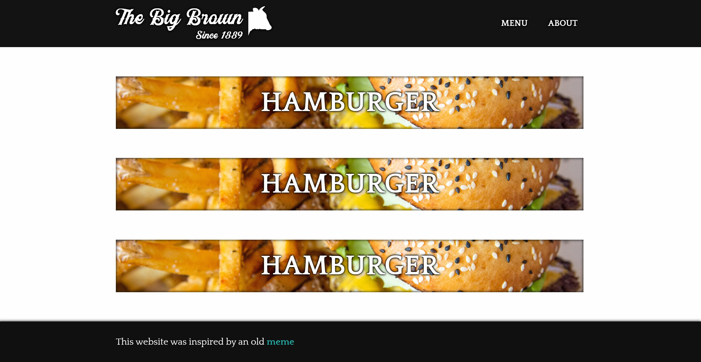

# the-big-brown-frontend
 Frontend for a restaurant's website. This is just the design / interactivity / idea.

https://kingofcaves.github.io/the-big-brown-frontend/

## GETTING STARTED

This is a design / frontend component to a website as a personal project. It can be used in any way you like, you can even completely change the theme or design yourself. You can even add a backend to it if you want to.

The project uses parcel to generate the static assets for the website. The source folder contains SCSS files, HTML templates and files, fonts, images, and javascript files. In order to compile to the docs folder you need to "npm run post" in console while in the root folder.

## SCREENSHOTS

## CREDITS

Burger and fries photo by <a href="/photographer/milspa-66785">milspa</a> from <a href="https://freeimages.com/">FreeImages</a>